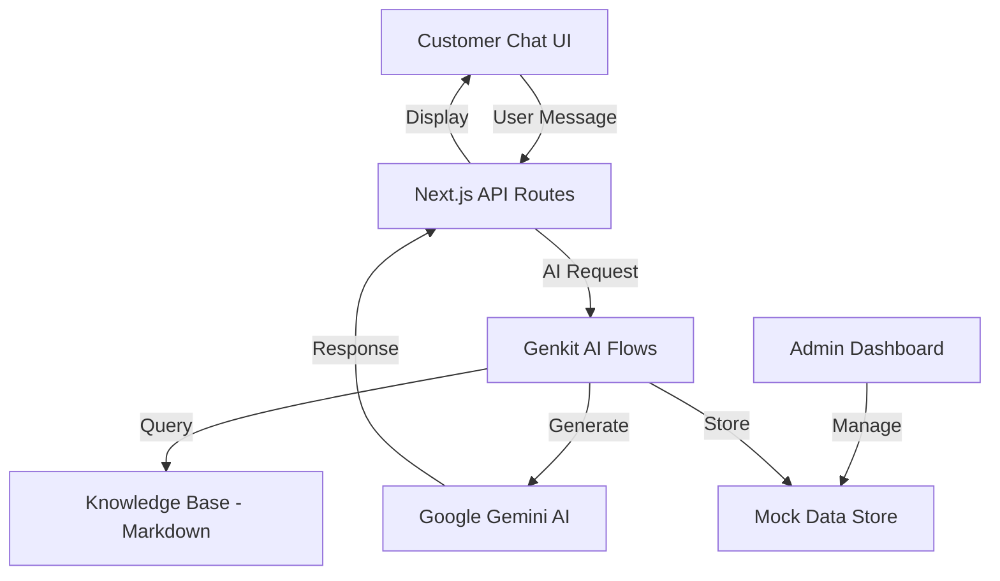

<div align="center">

# 🤖 OmniAssistant

### AI-Powered Conversational Chatbot with Business Intelligence

An intelligent chatbot platform for pest control services featuring lead qualification, knowledge base retrieval, and comprehensive admin dashboard. Built with Next.js and Google Genkit for powerful AI conversations.

[](https://opensource.org/licenses/MIT)
[](https://nextjs.org/)
[](https://www.typescriptlang.org/)
[](https://firebase.google.com/docs/genkit)

[Live Demo](#) · [Report Bug](https://github.com/mu7ammad-3li/OmniAssistant/issues) · [Request Feature](https://github.com/mu7ammad-3li/OmniAssistant/issues)

</div>

---

## 📑 Table of Contents

- [Features](#-features)
- [Demo](#-demo)
- [Architecture](#-architecture)
- [Tech Stack](#-tech-stack)
- [Getting Started](#-getting-started)
  - [Prerequisites](#prerequisites)
  - [Installation](#installation)
  - [Configuration](#configuration)
- [Project Structure](#-project-structure)
- [AI Flows](#-ai-flows)
- [Admin Dashboard](#-admin-dashboard)
- [Available Scripts](#-available-scripts)
- [Deployment](#-deployment)
- [Contributing](#-contributing)
- [License](#-license)
- [Contact](#-contact)

---

## ✨ Features

<table>
<tr>
<td width="50%">

### 🎯 Core Features
- **AI-Powered Conversations**: Intelligent chat using Google Gemini
- **Knowledge Base**: Markdown-based knowledge retrieval
- **Lead Qualification**: Smart form-based lead capture
- **Multi-Conversation**: Handle multiple customer chats
- **Real-time Responses**: Instant AI-generated replies
- **Context Awareness**: Maintains conversation history

</td>
<td width="50%">

### 🔒 Admin Features
- **Comprehensive Dashboard**: Full business overview
- **Conversation Management**: View and manage all chats
- **Lead Management**: Track and qualify potential customers
- **Order Tracking**: Monitor service orders and status
- **Knowledge Base Editor**: Manage FAQ and resources
- **Analytics**: Insights into customer interactions

</td>
</tr>
</table>

---

## 🎬 Demo

### Chat Interface

Customers interact with an intelligent AI assistant that can:
- Answer pest control questions from the knowledge base
- Qualify leads through conversational forms
- Provide service information and pricing
- Schedule appointments and consultations

### Admin Dashboard

Business owners get access to:
- **Overview Page**: Key metrics and recent activity
- **Conversations**: All customer chat histories
- **Leads**: Qualified prospects with contact information
- **Orders**: Service requests and their status
- **Knowledge Base**: Content management for FAQ

---

## 🏗️ Architecture



### Key Components

**Frontend (Next.js + React)**
- Server-side rendering for optimal performance
- Beautiful UI with shadcn/ui components
- Responsive design for all devices
- Real-time chat interface

**AI Layer (Genkit)**
- Conversation flow management
- Knowledge base retrieval with embeddings
- Lead qualification logic
- Integration with Google Gemini

**Backend (Next.js API Routes)**
- RESTful API endpoints
- Server actions for mutations
- Mock data storage (easily replaceable with DB)

---

## 🛠 Tech Stack

<div align="center">

### Frontend


### AI & Backend


### UI Components


</div>

---

## 🚀 Getting Started

### Prerequisites

Before you begin, ensure you have the following installed:

- **Node.js 20+** ([Download](https://nodejs.org/))
- **npm** or **yarn**
- **Google AI API Key** ([Get Key](https://ai.google.dev/) - Free tier available)

### Installation

1. **Clone the repository**
```bash
git clone https://github.com/mu7ammad-3li/OmniAssistant.git
cd OmniAssistant
```

2. **Install dependencies**
```bash
npm install
```

### Configuration

3. **Create environment file**

Create a `.env.local` file in the root directory:

```env
# Google AI (Gemini) Configuration
GOOGLE_GENAI_API_KEY=your-google-ai-api-key-here

# Application Configuration
NEXT_PUBLIC_APP_NAME=OmniAssistant
NEXT_PUBLIC_APP_URL=http://localhost:9002

# Optional: Development Settings
NODE_ENV=development
```

**Getting Google AI API Key:**
1. Visit [Google AI Studio](https://ai.google.dev/)
2. Sign in with your Google account
3. Click "Get API Key"
4. Create a new API key
5. Copy the key to your `.env.local` file

4. **Run the development server**

**Option 1: Next.js only**
```bash
npm run dev
```

**Option 2: Next.js + Genkit Dev UI**

In separate terminals:

```bash
# Terminal 1: Next.js dev server
npm run dev

# Terminal 2: Genkit development UI (for AI flow testing)
npm run genkit:dev
```

The application will be running at:
- **Next.js App**: http://localhost:9002
- **Genkit Dev UI**: http://localhost:4000 (if running genkit:dev)

5. **Build for production**
```bash
npm run build
npm run start
```

---

## 📁 Project Structure

```
OmniAssistant/
├── 📂 src/                          # Source code
│   ├── 📂 app/                      # Next.js app directory
│   │   ├── 📂 admin/               # Admin dashboard
│   │   │   ├── 📂 conversations/  # Conversation management
│   │   │   ├── 📂 leads/          # Lead management
│   │   │   ├── 📂 orders/         # Order management
│   │   │   ├── 📂 kb/             # Knowledge base editor
│   │   │   ├── layout.tsx         # Admin layout
│   │   │   └── page.tsx           # Dashboard overview
│   │   ├── 📂 api/                 # API routes
│   │   │   └── 📂 genkit/         # Genkit API endpoints
│   │   ├── 📂 chat/                # Customer chat interface
│   │   │   └── page.tsx           # Chat page
│   │   ├── layout.tsx              # Root layout
│   │   ├── page.tsx                # Home page
│   │   └── globals.css             # Global styles
│   ├── 📂 ai/                       # Genkit AI flows
│   │   ├── conversation-flow.ts    # Main conversation AI
│   │   ├── lead-qualification.ts   # Lead capture flow
│   │   ├── knowledge-retrieval.ts  # KB search flow
│   │   ├── dev.ts                  # Genkit dev server
│   │   └── index.ts                # AI exports
│   ├── 📂 components/               # React components
│   │   ├── 📂 ui/                  # shadcn/ui components
│   │   │   ├── button.tsx
│   │   │   ├── card.tsx
│   │   │   ├── dialog.tsx
│   │   │   └── ...
│   │   ├── 📂 chat/                # Chat components
│   │   │   ├── ChatMessage.tsx
│   │   │   ├── ChatInput.tsx
│   │   │   └── ChatInterface.tsx
│   │   ├── 📂 admin/               # Admin components
│   │   │   ├── Sidebar.tsx
│   │   │   ├── StatCard.tsx
│   │   │   └── DataTable.tsx
│   │   └── 📂 forms/               # Form components
│   │       └── LeadQualificationForm.tsx
│   ├── 📂 hooks/                    # Custom React hooks
│   │   ├── useChat.ts
│   │   └── useConversations.ts
│   ├── 📂 kb/                       # Knowledge base (Markdown)
│   │   ├── pest-identification.md
│   │   ├── treatment-methods.md
│   │   ├── prevention-tips.md
│   │   └── pricing-info.md
│   ├── 📂 lib/                      # Utilities
│   │   ├── mock-data.ts            # Mock data store
│   │   └── utils.ts                # Helper functions
│   └── 📂 types/                    # TypeScript types
│       ├── conversation.ts
│       ├── lead.ts
│       └── order.ts
├── 📂 public/                       # Static assets
├── .env.local                       # Environment variables (create this)
├── .env.example                     # Environment template
├── .gitignore                       # Git ignore rules
├── next.config.js                   # Next.js configuration
├── package.json                     # Dependencies and scripts
├── tailwind.config.ts               # Tailwind configuration
├── tsconfig.json                    # TypeScript configuration
└── README.md                        # This file
```

---

## 🤖 AI Flows

OmniAssistant uses Google Genkit to power three main AI flows:

### 1. Conversation Flow (`conversation-flow.ts`)

Handles general customer conversations:
- Understands pest control questions
- Retrieves relevant information from knowledge base
- Maintains conversation context
- Provides helpful, natural responses

### 2. Lead Qualification (`lead-qualification.ts`)

Intelligently qualifies potential customers:
- Asks relevant qualifying questions
- Captures contact information
- Assesses urgency and service needs
- Stores lead data for follow-up

### 3. Knowledge Retrieval (`knowledge-retrieval.ts`)

Searches the knowledge base:
- Converts Markdown files to embeddings
- Performs semantic search
- Returns relevant content chunks
- Integrates with conversation flow

### Testing AI Flows

Use the Genkit Dev UI to test AI flows in isolation:

```bash
npm run genkit:dev
```

Visit http://localhost:4000 to interact with individual flows.

---

## 📊 Admin Dashboard

The admin dashboard provides complete business management:

### Dashboard Overview
- **Total Conversations**: Count of customer chats
- **Active Leads**: Qualified prospects
- **Pending Orders**: Service requests awaiting action
- **Recent Activity**: Latest conversations and leads

### Conversations Page
- View all customer conversations
- Search and filter by customer or date
- See full conversation history
- Mark conversations as resolved

### Leads Page
- Manage qualified leads
- Contact information and needs
- Lead source and qualification status
- Export leads as CSV

### Orders Page
- Track service orders
- Update order status
- View customer details
- Manage fulfillment

### Knowledge Base
- Edit Markdown knowledge base files
- Add new FAQ entries
- Organize content by category
- Preview changes

---

## 📜 Available Scripts

```bash
# Development server (Next.js only)
npm run dev

# Genkit AI flow development UI
npm run genkit:dev

# Genkit with auto-reload (watch mode)
npm run genkit:watch

# Build for production
npm run build

# Start production server
npm run start

# Lint code
npm run lint

# Type check
npm run typecheck
```

---

## 🌐 Deployment

### Deploy to Vercel (Recommended)

1. **Install Vercel CLI**
```bash
npm install -g vercel
```

2. **Set environment variables in Vercel dashboard**
```
GOOGLE_GENAI_API_KEY=your-api-key
```

3. **Deploy**
```bash
vercel
```

### Deploy to Other Platforms

**Netlify:**
```bash
npm run build
# Deploy the .next folder
```

**Docker:**
```dockerfile
FROM node:20-alpine
WORKDIR /app
COPY package*.json ./
RUN npm ci
COPY . .
RUN npm run build
CMD ["npm", "start"]
```

---

## 🔄 Replacing Mock Data

The project currently uses mock data for demonstration. To integrate with a real database:

1. **Choose a database** (PostgreSQL, MongoDB, Firebase, etc.)
2. **Install database client**
```bash
npm install prisma @prisma/client  # Example for Prisma
```
3. **Replace mock functions in `src/lib/mock-data.ts`**
4. **Update API routes** to use real database queries
5. **Add authentication** for admin dashboard

---

## 🤝 Contributing

Contributions are what make the open-source community amazing! Any contributions you make are **greatly appreciated**.

1. Fork the Project
2. Create your Feature Branch (`git checkout -b feature/AmazingFeature`)
3. Commit your Changes (`git commit -m 'Add some AmazingFeature'`)
4. Push to the Branch (`git push origin feature/AmazingFeature`)
5. Open a Pull Request

---

## 📝 License

Distributed under the MIT License. See `LICENSE` for more information.

---

## 📧 Contact

**Muhammad Ali**

- GitHub: [@mu7ammad-3li](https://github.com/mu7ammad-3li/)
- Email: muhammad.3lii2@gmail.com
- LinkedIn: [linkedin.com/in/muhammad-3lii](https://linkedin.com/in/muhammad-3lii)

**Project Link**: [https://github.com/mu7ammad-3li/OmniAssistant](https://github.com/mu7ammad-3li/OmniAssistant)

---

## 🙏 Acknowledgments

- [Next.js](https://nextjs.org/) - React framework
- [Google Genkit](https://firebase.google.com/docs/genkit) - AI orchestration framework
- [Google Gemini](https://ai.google.dev/) - Large language model
- [shadcn/ui](https://ui.shadcn.com/) - UI components
- [Tailwind CSS](https://tailwindcss.com/) - Styling
- [Radix UI](https://www.radix-ui.com/) - Headless UI components

---

<div align="center">

**Built with ❤️ by [Muhammad Ali](https://github.com/mu7ammad-3li/)**

*Intelligent Conversations, Powered by AI*

[⬆ Back to Top](#-omniassistant)

</div>
